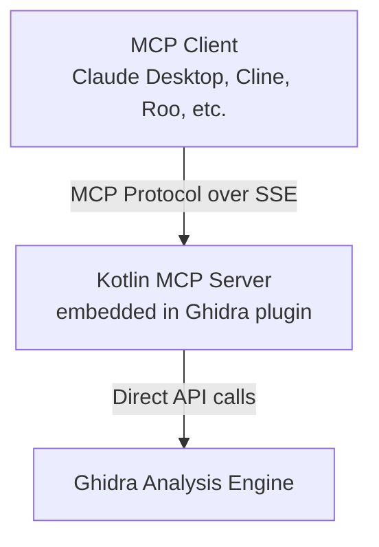

# KGhidraMCP

KGhidraMCP is a Model Context Protocol (MCP) server embedded directly in a Ghidra plugin, allowing LLMs to autonomously reverse engineer applications. It exposes numerous tools from core Ghidra functionality to MCP clients via a native Kotlin implementation.

## Architecture

This is a **native Kotlin implementation** that embeds an MCP server directly in the Ghidra plugin, eliminating the need for external Python bridges.



### Key Benefits

- ✅ **Single Artifact**: No Python dependencies, just the Ghidra plugin
- ✅ **Native MCP Protocol**: Direct implementation using the official Kotlin SDK
- ✅ **Better Performance**: No HTTP → Python → MCP translation overhead
- ✅ **Type Safety**: Kotlin's type system + MCP schema validation
- ✅ **SSE Native**: Built-in streaming support via Ktor
- ✅ **Easier Deployment**: Install plugin, configure port, done

## Features

- Decompile and analyze binaries in Ghidra
- Automatically rename methods, variables, and data
- List methods, classes, imports, exports, and strings
- Search functions by name
- Add comments and set function signatures
- Navigate cross-references
- All tools support pagination for large datasets

## Available Tools

The plugin exposes **29 MCP tools** organized into categories:

### Decompilation Tools (6 tools)
- **get_function_by_address** - Get function info by address
- **get_current_function** - Get function at cursor
- **decompile_function** - Decompile by name
- **decompile_function_by_address** - Decompile by address
- **disassemble_function** - Get assembly listing
- **list_functions** - List all functions

### Listing Tools (8 tools)
- **list_methods** - List function names (paginated)
- **list_classes** - List class/namespace names (paginated)
- **list_segments** - List memory segments (paginated)
- **list_imports** - List import symbols (paginated)
- **list_exports** - List export symbols (paginated)
- **list_namespaces** - List namespaces (paginated)
- **list_data_items** - List defined data (paginated)
- **list_strings** - List strings with filter (paginated)

### Search Tools (1 tool)
- **search_functions_by_name** - Search functions by substring

### Modification Tools (4 tools)
- **rename_function** - Rename function by name
- **rename_function_by_address** - Rename function by address
- **rename_variable** - Rename local variable
- **rename_data** - Rename data label

### Annotation Tools (4 tools)
- **set_decompiler_comment** - Add decompiler comment
- **set_disassembly_comment** - Add disassembly comment
- **set_function_prototype** - Set function signature
- **set_local_variable_type** - Set variable type

### Navigation Tools (6 tools)
- **get_current_address** - Get cursor address
- **get_current_function_info** - Get function at cursor location
- **get_xrefs_to** - Get references to address (paginated)
- **get_xrefs_from** - Get references from address (paginated)
- **get_function_xrefs** - Get function xrefs (paginated)
- **get_caller_functions** - Get callers of a function (paginated)

## Installation

### Prerequisites
- [Ghidra](https://ghidra-sre.org) 11.0 or later
- Java 17 or later

### Install the Plugin

1. Download the latest release or build from source
2. Run Ghidra
3. Select `File` → `Install Extensions`
4. Click the `+` button
5. Select the `KGhidraMCP.zip` file
6. Restart Ghidra
7. In a CodeBrowser tool, go to `File` → `Configure...`
8. Under "Miscellaneous", check the box for "KGhidraMCPPlugin"
9. Click "OK"

### Configure the Plugin

The plugin can be configured via Ghidra's Tool Options:

1. Go to `Edit` → `Tool Options`
2. Navigate to `KGhidraMCP Server`
3. Configure:
   - **Server Port**: Port for MCP server (default: 3001)
   - **Auto-start Server**: Start server when plugin loads (default: true)

**Note**: Port changes require plugin reload or Ghidra restart.

## MCP Client Configuration

The MCP server runs on `http://localhost:3001/` by default (configurable in Ghidra). The server uses **Server-Sent Events (SSE)** transport exclusively.

### Claude Desktop

Add to your Claude Desktop configuration (`claude_desktop_config.json`):

```json
{
  "mcpServers": {
    "ghidra": {
      "type": "sse",
      "url": "http://localhost:3001/"
    }
  }
}
```

Configuration file location:
- **macOS**: `~/Library/Application Support/Claude/claude_desktop_config.json`
- **Windows**: `%APPDATA%\Claude\claude_desktop_config.json`
- **Linux**: `~/.config/Claude/claude_desktop_config.json`

### Cline (VS Code)

To use KGhidraMCP with [Cline](https://cline.bot):

1. Open Cline and select `MCP Servers` at the top
2. Select `Remote Servers` and add:
   - **Server Name**: KGhidraMCP
   - **Server URL**: `http://localhost:3001/`

Alternatively, manually configure in `cline_mcp_settings.json`:

```json
{
  "mcpServers": {
    "ghidra": {
      "type": "sse",
      "url": "http://localhost:3001/"
    }
  }
}
```

### Roo Code (VS Code)

To use KGhidraMCP with Roo Code, add to `.roo/mcp.json`:

```json
{
  "mcpServers": {
    "ghidra": {
      "type": "sse",
      "url": "http://localhost:3001/"
    }
  }
}
```

### ChatGPT (OpenAI)

To use KGhidraMCP with ChatGPT (requires Pro, Team, or Enterprise plan):

1. Enable **Developer Mode** in ChatGPT:
   - Go to Settings → Connectors → Advanced → Developer Mode
2. Add a custom MCP connector:
   - Click "Create" or "Add Connector"
   - Set the SSE URL to: `http://localhost:3001/`
   - Configure any required authentication (if applicable)

**Note**: Developer Mode is a beta feature. Ensure your ChatGPT plan supports custom connectors.

### VS Code Copilot

To use KGhidraMCP with GitHub Copilot in VS Code:

1. Open VS Code settings (JSON format)
2. Add the following MCP server configuration:

```json
{
  "github.copilot.chat.mcp.servers": {
    "ghidra": {
      "type": "sse",
      "url": "http://localhost:3001/"
    }
  }
}
```

Alternatively, configure via `mcp.json` in your workspace or user settings directory.

### Other MCP Clients

For any MCP client that supports SSE connections, use the endpoint:
```
http://localhost:3001/
```

The server uses **SSE (Server-Sent Events)** transport exclusively. Ensure your MCP client supports SSE remote servers.

## Usage Examples

### With Claude Desktop

Once configured, you can interact with Ghidra through Claude:
```
You: "Decompile the function at address 0x1400010a0"

Claude: [Uses decompile_function_by_address tool]
Here's the decompiled code:
...
```

```
You: "Find all functions that contain 'encrypt' in their name"

Claude: [Uses search_functions_by_name tool]
Found 3 functions:
- encrypt_data at 0x14000a120
- decrypt_data at 0x14000a340
- init_encryption at 0x14000a560
```

```
You: "Rename the function at 0x1400010a0 to process_input"

Claude: [Uses rename_function_by_address tool]
Successfully renamed function to 'process_input'
```

## Building from Source

### Prerequisites

- Java 17 or later
- Gradle 8.x or later
- Ghidra 11.0 or later
- `GHIDRA_INSTALL_DIR` environment variable set to your Ghidra installation directory

### Build Steps

1. Set the `GHIDRA_INSTALL_DIR` environment variable:
   ```bash
   export GHIDRA_INSTALL_DIR=/path/to/ghidra
   ```

2. Build the extension:
   ```bash
   gradle clean packageExtension
   ```

3. The installable extension will be created at:
   ```
   dist/KGhidraMCP.zip
   ```

### Using NixOS/devenv

If you're using the provided devenv environment:

```bash
# Enter the devenv shell
devenv shell

# Build the extension
gradle clean packageExtension
```

## Technical Details

### Technology Stack

- **Language**: Kotlin 2.1.0
- **MCP SDK**: Official Kotlin SDK 0.5.0
- **Server**: Ktor 3.0.0 (Netty + SSE)
- **Serialization**: kotlinx.serialization 1.6.2
- **Async**: kotlinx.coroutines 1.7.3

### Thread Safety

All Ghidra API calls are automatically marshalled to the Swing Event Dispatch Thread (EDT) via the `GhidraContext` wrapper, ensuring thread safety.

### Error Handling

All tools follow consistent error handling:
- Exceptions are caught and returned as structured error responses
- Missing parameters trigger clear error messages
- Invalid addresses or non-existent functions are handled gracefully

### Pagination

Tools that return large datasets support pagination via `offset` and `limit` parameters:
- Default `offset`: 0
- Default `limit`: 100
- Maximum `limit`: User-definable per query

## Credits

- Inspired by the original [GhidraMCP](https://github.com/LaurieWired/GhidraMCP) by [@LaurieWired](https://github.com/LaurieWired)
